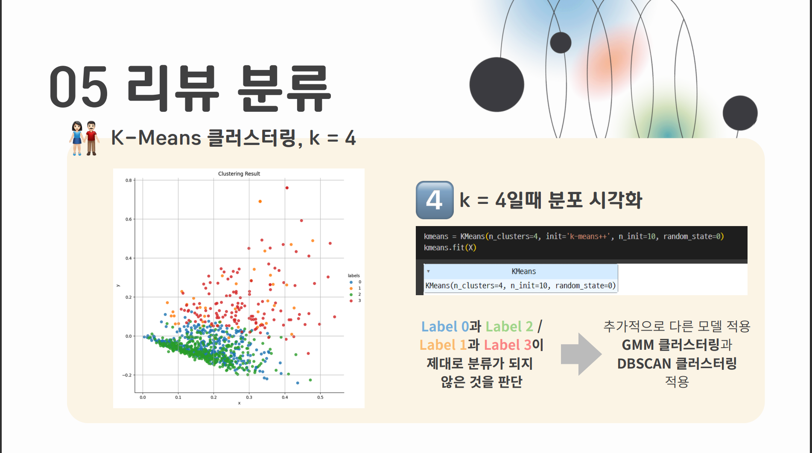
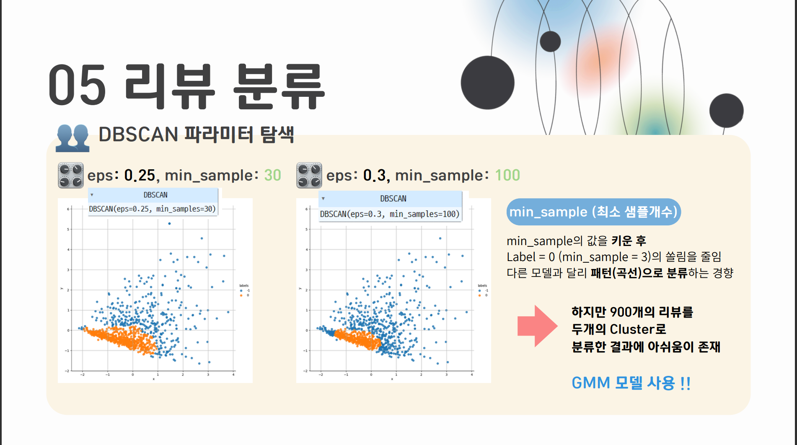
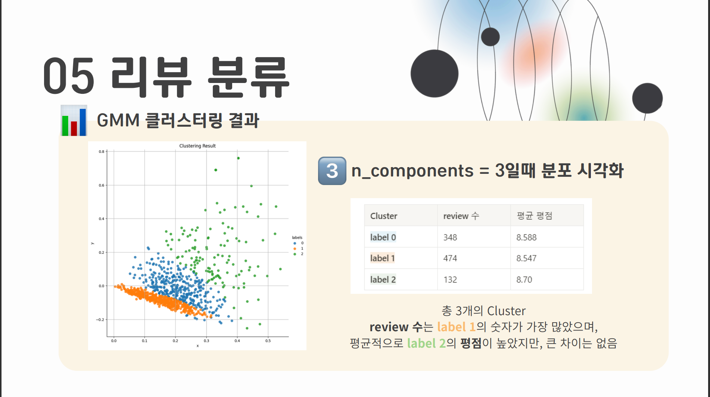
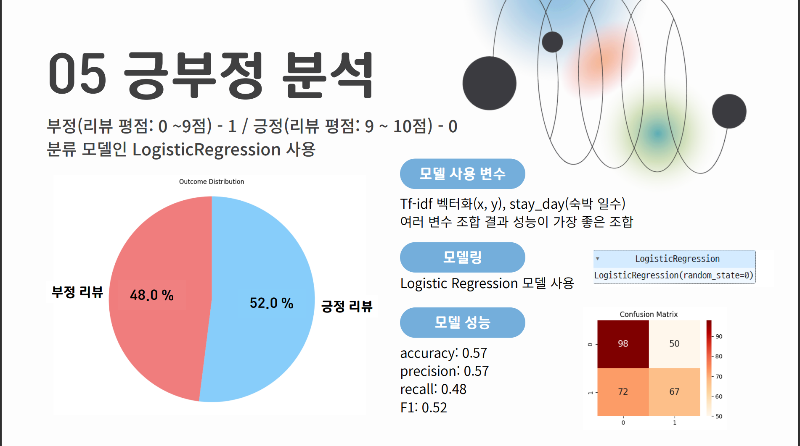
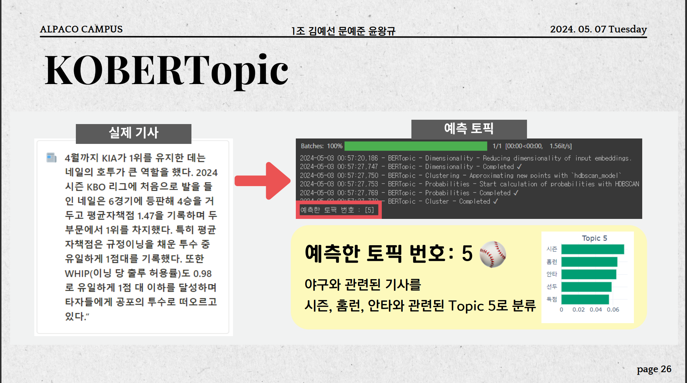
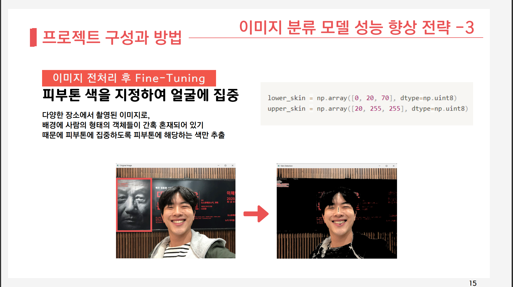
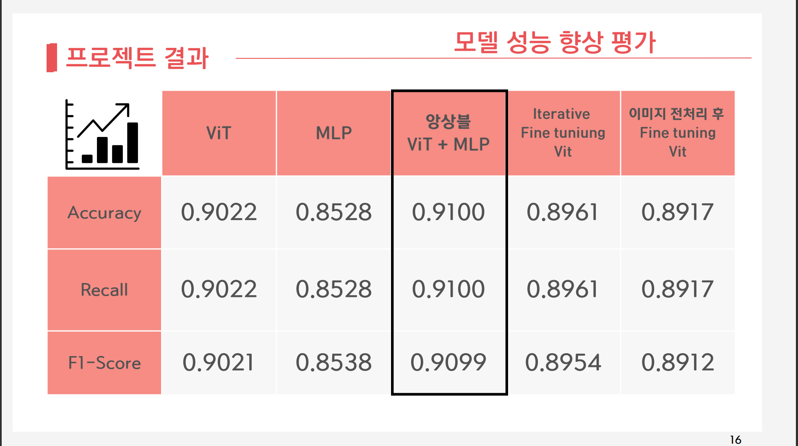

# Deep-Learning-Bootcamp-Project

# Text Mining Project

### 1) 프로젝트 수행 기간
2024/3/21 ~ 2024/4/12, 딥러닝 부트캠프 미니 프로젝트 활동

### 2) 프로젝트 진행 파트 
데이터 크롤링(Selenium)

데이터 전처리 및 파생변수 생성 

데이터 분석 및 모델링(클러스터링 - K-Means, DBScan, GMM, Logistic Regression)

### 3) 프로젝트 개요
아고다 호텔 리뷰를 분석하는 프로젝트

### 4) 데이터
아고다 호텔 리뷰 2,000개 크롤링

### 5) 프로젝트 주요 내용
[tf-idf 기반 리뷰 클러스터링(K-means, DBscan, GMM)]

[긍부정 분석]

---- 
# NLP Project

### 1) 프로젝트 수행 기간 
2024/4/15 ~ 2024/5/6, 딥러닝 부트캠프 미니 프로젝트 활동 

### 2) 프로젝트 진행 파트
데이터 전처리 

데이터 분석 및 모델링(KeyBert, BerTopic, Attention)

### 3) 프로젝트 개요

### 4) 데이터
AI hub, 뉴스 음성, 텍스트 데이터

### 5) 프로젝트 주요 내용
**[뉴스 토픽 분류]**

**[뉴스 키워드 추출(Attention)]**

**[뉴스 키워드 추출(KeyBert)]**

---

# Image Classification Project

### 1) 프로젝트 수행 기간
2024/5/9 ~ 2024/5/29, 딥러닝 부트캠프 미니 프로젝트 활동

### 2) 프로젝트 진행 파트 
데이터 전처리 

모델링 (Vit 파인튜닝, MLP Mixer 파인튜닝)

### 3) 프로젝트 개요
AI 면접에서 지원자의 표정을 분석할 수 있는 서비스

### 4) 데이터
AI hub 얼굴 표정 데이터 사용

### 5) 프로젝트 주요 내용
**[이미지 전처리]**

**[파인튜닝]**

